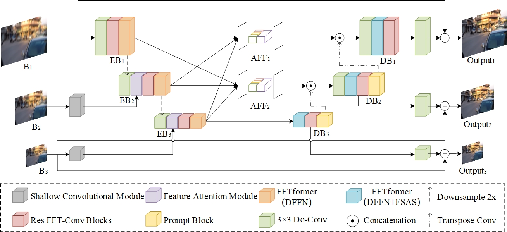

# PFTNet

## Network Architecture


## Install
##The model is built in PyTorch 1.8.0 and tested on Ubuntu 18.04 environment (Python3.8, CUDA11.1).
```
-conda create -n pytorch python=3.8
-conda activate pytorch
-conda install pytorch==1.8.0 torchvision==0.9.0 torchaudio==0.8.0 cudatoolkit=11.1 -c pytorch -c conda-forge
-pip install matplotlib scikit-image opencv-python yacs joblib natsort h5py tqdm kornia tensorboard ptflops

```
##pre-trained models
链接：https://pan.baidu.com/s/1DFpMTLUiNrAAxhwOhNL9CQ 
提取码：4zqm

## Training

```python train.py ```

## Testing
```python test.py```


Install warmup scheduler

cd pytorch-gradual-warmup-lr; python setup.py install; cd ..
